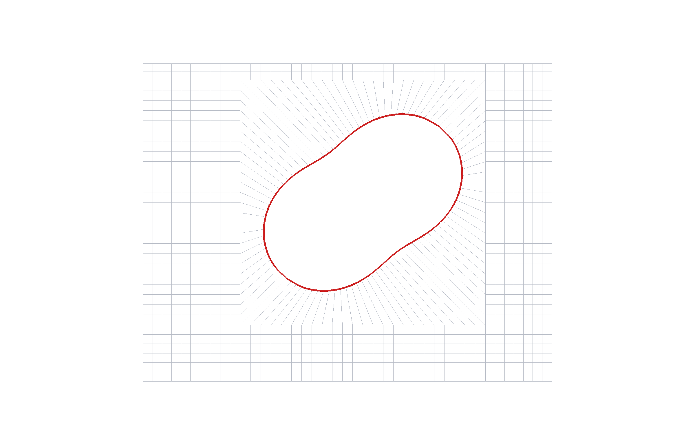

# The optimal obstacle shape — what it is and why it works

*Companion to `runs/fixed_mesh/result_deformed.jld2` and `docs/optimal_shape.png`.*

## The result in one line

The shape that maximizes the vicinity signal `f₁` is a **large, smooth, tilted oval,
offset toward one wall** — mean radius ≈ 0.37, with a modest "sin-2θ" bulge, sitting
off-center in a tall channel. It reaches **f₁ ≈ 0.144**, roughly **4.4× a plain round
circle** (0.033) and well above a square obstacle (0.094).



---

## First, what f₁ actually measures

Push a current `I` through the sample. Two voltage probes on opposite walls read
potentials `V_A` and `V_B`. The number we care about is

```
f₁ = (V_A − V_B) / I
```

— a *nonlocal* "vicinity resistance": how much of an imbalanced voltage the obstacle
creates between the two probes as current flows around it. Bigger `|f₁|` = the obstacle
deflects the current more lopsidedly.

So the whole game is: **shape the obstacle so it pushes current much more toward one
probe than the other.**

---

## Why the optimal shape looks the way it does

### 1. It must be *off-center* — symmetry is the enemy
If the obstacle sits dead-center and is left–right and up–down symmetric, then whatever
it does to probe A it does equally to probe B, so `V_A = V_B` and **f₁ = 0 exactly**.
This isn't a numerical accident — it's a mirror symmetry of the whole device.

Think of a rock in a stream: a rock centered in the channel splits the water evenly to
both banks (no net difference). Slide the rock toward one bank and it shoves more water
to the far side. **The optimizer offsets the obstacle in *both* directions** (up, and
along the flow) to break both mirrors — that's what turns the signal on.

### 2. The "oval" (sin-2θ) is a better deflector than a circle
A perfect circle is the *least* directional shape — it looks the same from every angle,
so it deflects current symmetrically. Squashing it into a **tilted oval** (that's what
the "sin-2θ" deformation is) gives it a long side and a short side at an angle to the
flow. That angled profile acts like a little **vane**, steering current preferentially to
one probe. The optimizer independently discovered this — it pushed the oval deformation
up to its allowed limit while leaving the higher wiggles (sin-3θ) near zero, because the
tilted-oval mode is the one that couples the flow direction into a left–right imbalance.
(This matches what earlier hand-analysis predicted: "a big circle with dimples.")

### 3. Bigger is better — but only if it can stay off-center
A larger obstacle blocks and deflects more current, so `f₁` grows with size. But there's
a catch: in a **short** channel, a big obstacle has to sit near the center just to fit
between the walls — and centering kills the signal (point 1). So size and offset fight
each other. **That's why we used a taller channel:** it gives the obstacle room to be
*both* large *and* strongly offset. That single change is most of the jump from 0.033 to
0.144.

### 4. It stays *round* on purpose
We deliberately kept the shape smooth and circular-ish (no sharp corners or spikes).
Sharp corners create unphysical flow "hot spots" (singularities) that are both physically
questionable and numerically nasty. A smooth oval deflects the current cleanly, so the
number it produces is trustworthy.

**Putting it together:** the best shape is the largest smooth oval that can still sit well
off-center, tilted so its long axis steers current toward one probe. Not a circle (too
symmetric), not a square (corners), not a spike (unphysical) — a **big, tilted, offset
oval**.

---

## Special clarification: why the mesh looks "diagonal" around the obstacle

This is the part that looks strange at first, so here's the full justification.

**What you're seeing.** To compute the flow we chop the sample into many small
quadrilateral cells (a "mesh") and solve on them. Far from the obstacle the cells are the
usual horizontal/vertical rectangles. But in a ring *around the obstacle* the grid lines
run **radially** (outward from the obstacle) and **circumferentially** (around it), so
they look diagonal and curved. That ring is called an **O-grid** (the cells form an "O"
around the object).

**Why it has to be that way — three reasons, each load-bearing:**

1. **A straight rectangular grid can't represent a round boundary.** If we forced
   horizontal/vertical cells right up to the circle, the boundary would come out as a
   jagged **staircase** of little steps instead of a smooth curve. Those steps are fake
   corners — they change the physics (spurious deflection, hot spots) and give the wrong
   answer. The O-grid instead lays cells *along* the curve ("body-fitted"), so the
   obstacle's reflecting wall is represented smoothly and correctly.

2. **A structured grid is what makes the solver trustworthy.** Our fast solver needs a
   *regular*, well-ordered grid to converge. We actually tried the lazy alternative — an
   **unstructured** mesh (irregular triangles/quads auto-filled around a hole) — and it
   failed badly: the solver wouldn't converge, and the computed `f₁` scattered wildly
   between about −6 and +6 and even flipped sign as we refined the mesh. Completely
   untrustworthy. Switching to the structured O-grid is exactly what fixed that: the
   solver converges cleanly and `f₁` settles to a stable value. **The diagonal cells are
   the price of, and the reason for, a trustworthy number.**

3. **The diagonal ring is the "stitch" between round and rectangular.** The obstacle
   boundary is round; the channel is rectangular. Something has to smoothly connect the
   two. The O-grid ring does exactly that — its inner edge hugs the oval, its outer edge
   matches the rectangular grid, and the cells rotate gradually in between (hence the
   diagonal look). This is a completely standard technique in engineering simulation —
   it's how airplane-wing and pipe-flow meshes are built.

**So the diagonal mesh is not an error, an artifact, or randomness.** It is the
deliberate, standard, and *necessary* way to wrap a structured, trustworthy grid around a
curved object. If the mesh were all horizontal/vertical lines, either the circle would be
a jagged staircase (wrong physics) or the solver would fail (no number at all).

*(Related: the little "box" the obstacle sits in is just the outer edge of this O-grid
ring — radius + a thin collar. It scales and moves with the obstacle and is invisible to
the physics; it only marks where the cells switch from curved to rectangular.)*

---

## How much to trust the number

`f₁ ≈ 0.144` is not a one-off reading — it holds up under the checks that matter:
- **Mesh refinement:** as we shrink the cells, `f₁` stops moving (changes ~0.3% on the
  finest step) — it has converged.
- **Angular resolution:** increasing the number of velocity-angle harmonics barely moves
  it (<1%).
- **Independent method:** the same coefficients reproduce a full nonlinear solve to
  ~0.05%.

So the shape *and* the number are solid.

## One honest caveat

The reflecting-wall obstacle here uses a diffuse (no-slip) wall and the standard
harmonic-moment transport model; the magnitude is the trustworthy *geometric transverse*
response for this device. Pushing further (still-taller channel, a couple more shape
harmonics, or the higher-order coefficients f₂/f₃ on this same shape) would refine it,
but the physics of *why this shape wins* — big, smooth, tilted, off-center — would not
change.
